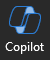

---
demo:
  title: 'العرض التوضيحي: Copilot في Word'
---

[العودة إلى الفهرس](https://microsoftlearning.github.io/MS-4012-Microsoft-Copilot-Web-Based-Interactive-Experience-for-Executives/)

# Microsoft 365 Copilot في Word

## إعداد العرض التوضيحي

يمكن العثور على المستندات النموذجية في مستودع MS-4012 GitHub [هنا](https://github.com/MicrosoftLearning/MS-4012-Microsoft-Copilot-Unlocked/tree/master/Resourcefiles).

الملفات المحددة المستخدمة في هذا التدريب هي:

- [**ContosoLearn App Overview.docx**](https://github.com/MicrosoftLearning/MS-4012-Microsoft-Copilot-Unlocked/raw/master/Resourcefiles/ContosoLearn%20App%20Overview.docx)
- [**ContosoLearn Competitor SWOT.docx**](https://github.com/MicrosoftLearning/MS-4012-Microsoft-Copilot-Unlocked/raw/master/Resourcefiles/ContosoLearn%20Competitor%20SWOT.docx)
- [**ContosoLearn Value Proposition.docx**](https://github.com/MicrosoftLearning/MS-4012-Microsoft-Copilot-Unlocked/raw/master/Resourcefiles/ContosoLearn%20Value%20Proposition.docx)
- (اختياري - راجع التعليمات أدناه) [**مؤتمر عبر الهاتف حول أرباح الربع الثاني من السنة المالية 2024 لشركة Microsoft**](https://github.com/MicrosoftLearning/MS-4012-Microsoft-Copilot-Unlocked/raw/master/Resourcefiles/Microsoft_FY24_Second_Quarter_Earnings_Conference_Call.docx) 

> **ملاحظة:** قد تستغرق مزامنة هذه الملفات مع OneDrive ما يصل إلى 10 دقائق. لتسريع هذه العملية، يمكنك فتح المستند ثم إغلاقه، مما سيؤدي إلى إضافته إلى قائمة "الأكثر استخدامًا مؤخرًا" (MRU).

## Talking Points

في التجربة التفاعلية، تبادلنا الأفكار حول تطبيقات أو خدمات جديدة، وأنشأنا هوية العلامة التجارية وأصول التسويق، وحلّلنا المشهد التنافسي. ولكن كيف يمكننا أن نخطو خطوة أبعد من ذلك؟

باستخدام Copilot في Word، يمكننا تحويل عملية إنشاء المستندات وتحسينها، مما يتيح لك إنتاج محتوى مقنع بكل سهولة.

في هذا العرض التوضيحي، سنأخذ المستندات التي أنشأناها للتو ونحولها معًا لإنشاء تقرير تحليل استراتيجي. بالإضافة إلى ذلك، سنقوم بتعديل التنسيق والنبرة لضمان أن المحتوى يتماشى تمامًا مع أهدافنا.

## خطوات العرض التوضيحي

1. شغّل Microsoft Word إما على سطح المكتب أو عن طريق كتابة **Word.new** في علامة تبويب Edge جديدة.
1. انقر فوق النص الأساسي للمستند وحدد **أيقونة Copilot** المعروضة.

    

1. في Word، يجب الآن عرض نافذة **صياغة مسودة بواسطة Copilot**. في حقل المطالبة، أدخل المطالبة التالية:

    ```text
    Create a comprehensive strategic analysis report for ContosoLearn using the following files as references: /ContosoLearn App Overview, /ContosoLearn Competitor SWOT, and /ContosoLearn Value Proposition. The strategic analysis report should include the following sections:
        
    Executive Summary
    App Overview
    Market Research
    Competitor SWOT Analysis
    Value Proposition
    Conclusion
    ```

    > **هام:** ستحتاج إلى إعادة كتابة "/" وتحديد الملفات الصحيحة من قائمة "الأكثر استخدامًا مؤخرًا" (MRU) لكي تعمل هذه الوظيفة بشكل صحيح.

1. سيقوم Copilot الآن بإنشاء مسودة لتقرير التحليل الاستراتيجي استنادًا إلى المطالبة التي قدمتها. بمجرد انتهاء Copilot من عمله، سيتم عرض نافذة المطالبة التالية:

    
    
    في حقل المطالبة، أدخل ما يلي:

    ```text
    Remove the "Market Research" section and add a "Competitive Landscape" section. Ensure the content is concise and aligns with the overall tone of the document.
    ```

    > **ملاحظة:** إذا لم يتعاون Copilot لـ Word معك، فيمكنك استخدام الرابط التالي للوصول إلى المستند الذي تم إنشاؤه: [**مثال على إخراج Word من ContosoLearn**](https://github.com/MicrosoftLearning/MS-4012-Microsoft-Copilot-Unlocked/raw/master/Resourcefiles/ContosoLearn%20Example%20Word%20Output%20(not%20to%20be%20used).docx).

## خطوات العرض التوضيحي الاختيارية

### تلخيص مستند كبير

1. نزّل الملف التالي وافتحه في Word على سطح المكتب: [**مؤتمر عبر الهاتف حول أرباح الربع الثاني من السنة المالية 2024 لشركة Microsoft**](https://github.com/MicrosoftLearning/MS-4012-Microsoft-Copilot-Unlocked/raw/master/Resourcefiles/Microsoft_FY24_Second_Quarter_Earnings_Conference_Call.docx).
1. في Word، على الشريط، حدد **أيقونة Copilot**.

    

1. في الحقل **اسألني أي شيء عن هذا المستند**، انسخ وألصق المطالبة أو اكتب: 

    ```text
    Based on the document, how did AI impact Microsoft's earnings this year?
    ```

1. حدد **إرسال**.  
1. في الحقل **اسألني أي شيء عن هذا المستند**، انسخ وألصق المطالبة أو اكتب: 

    ```text
    Copilot, generate a FAQ based on this document.
    ```
    
1. حدد **إرسال**.

[العودة إلى الفهرس](https://microsoftlearning.github.io/MS-4012-Microsoft-Copilot-Web-Based-Interactive-Experience-for-Executives/)
