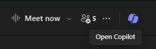

---
demo:
  title: 'العرض التوضيحي: Copilot في Teams'
---

[العودة إلى الفهرس](https://microsoftlearning.github.io/MS-4012-Microsoft-Copilot-Web-Based-Interactive-Experience-for-Executives/)

# Microsoft 365 Copilot في Teams

## إعداد العرض التوضيحي

لضمان عرض توضيحي سلس، اختر أحد خيارات الإعداد التالية:

**الخيار أ: خلاصة الاجتماع**

يمكن العثور على إرشادات إعداد العرض التوضيحي لهذا الخيار [هنا](https://microsoft.seismic.com/Link/Content/DCFPQWmT2DMXC8WJjgjP4H44GWXG). بالتحديد، راجع الصفحات من 5 إلى 10 التي تغطي كيفية إعداد اجتماع Teams (Project Avalon) الذي سنشير إليه في العرض التوضيحي أدناه.

> **مهم:**
> - سيتطلب إعداد العرض التوضيحي للخيار أ أربعة أشخاص على الأقل (اختياريًا 6).
> - قم بإجراء ذلك مع فريقك قبل التسليم المقرر.
> - بمجرد الانتهاء، يمكنك الرجوع إلى اجتماع Teams هذا للتسليمات المستقبلية.
> - إذا لم تتمكن من القيام بالإعداد لأي سبب من الأسباب، فراجع العرض التوضيحي للخيار ب.

**الخيار ب: دردشة Teams**

قصدًا، لا يتطلب خيار العرض التوضيحي هذا إعدادًا مسبقًا. ومع ذلك، تحتاج إلى الاستفادة من أحد سلاسل دردشة Teams الخاصة بك والموجودة مسبقًا. تأكد من عدم مشاركتك لمعلومات سرية في هذه الدردشة قبل استخدامها في العرض التوضيحي الخاص بك.


## الخيار أ - عرض توضيحي لملخص الاجتماع

### Talking Points

"الآن، سأوضح لكم ما نسميه ملخص الاجتماع في Teams.

هذا اجتماع بيني وبين زملائي. لا يمكننا أن نعرض لك اجتماعنًا الحقيقي لأسباب تتعلق بالسرية، ولكن فيما يلي اجتماع وهمي سجلته مع فريقي حيث نتحدث فيه عن إطلاق منتج تخيليًا يسمى مشروع Avalon.

استند الملخص إلى التدوين المُسجل. ويُظهر من كان مشاركًا ومتى كانوا يتحدثون. هناك أيضا ملخص لما كنا نتحدث عنه. نظم Copilot اجتماعي حسب الأقسام لتسهيل العثور على ما أبحث عنه.

الآن يمكنني طرح أسئلة على Copilot والحصول على مزيد من المعلومات حول هذا الاجتماع. على سبيل المثال، دعونا نرى ما تم مناقشته وما هي عناصر الإجراءات لكل شخص."

### خطوات العرض التوضيحي

1. قم بالتبديل إلى علامة تبويب المستعرض مع فتح Microsoft Teams للاجتماع **بدء اجتماع مشروع Avalon**.

    > **هام:** لا تعرض أي اجتماعات أو دردشات تحتوي على بيانات سرية.

1. حدد علامة تبويب**الملخص**.

    

1. أشر إلى **المتحدثين**.
1. حدّد **الموضوعات**.

    

1. حدد **الفصول**.

    

1. في الزاوية العلوية اليمنى، حدد **Copilot**.

    

1. في مربع نص**اسألني عن أي شيء حول هذا الاجتماع** ، انسخ الطلب والصقه:

    ```text
    Can you list action items and owners in a table?
    ```

1. حدد **إرسال**.
1. في مربع نص**اسألني عن أي شيء حول هذا الاجتماع** ، انسخ الطلب والصقه: 

    ```text
    Did anyone strongly oppose the decision, and how do you know?
    ```
    
1. حدد **إرسال**.
1. في مربع نص**اسألني عن أي شيء حول هذا الاجتماع** ، انسخ الطلب والصقه:

    ```text
    Based on the transcript, when would you recommend we launch the product and why?
    ```

1. حدد **إرسال**.

## الخيار ب - دردشة Teams

### Talking Points

"الآن، سأريك كيف يمكن لـ Copilot تحسين تجربة دردشة Teams.

فيما يلي سلسلة دردشة بيني وبين زملائي. يساعد Copilot من خلال تلخيص أهم النقاط من دردشتنا، مما يسهل متابعة النقاط المهمة دون الحاجة إلى قراءة كل رسالة.

الآن يمكنني طرح أسئلة على Copilot للحصول على معلومات أكثر تحديدًا من الدردشة. على سبيل المثال، دعنا نكتشف ما هي العناصر المفتوحة وكيف ينبغي لنا المضي قدمًا في الخطوات التالية.

بالإضافة إلى ذلك، يمكنني صياغة مسودة رد واستخدام Copilot لتحسينه، والتأكد من أن رسالتي واضحة وموجزة. وهذا مفيد بشكل خاص لضمان التواصل الفعال داخل الفريق."

### خطوات العرض التوضيحي

1. ابحث عن سلسلة رسائل Teams Chat التي لم تشارك فيها أي معلومات سرية. حدد الخيار **فتح الدردشة في نافذة جديدة**.

    

1. عند فتح Teams Chat في نافذة جديدة، حدد **فتح Copilot** في الزاوية اليمنى العليا.

    

1. في جزء الدردشة Copilot الذي يُفتح، حدد **أبرز ما حدث في اليوم الماضي*** للحصول على ملخص سريع للدردشات في اليوم الماضي.

    

1. في مربع النص **اطرح سؤالًا حول هذه الدردشة**، انسخ وألصق المطالبة: 

    ```text
    What are the open items?
    ```
    > **ملاحظة:** لا تتردد في اختيار مثال لمطالبة بديلة تعتقد أنه سيستهدف جمهورك بشكل أفضل.   

1. تحت سجل الدردشة، في مربع النص **اكتب رسالة**، ابدأ في كتابة الرد. **لا تضغط على الإرسال بعد.**

1. باستخدام مسودة ردك، حدد Copilot من مربع النص **اكتب رسالة**.

       

1. جرّب خياري **إعادة الكتابة** و**الضبط** لـ Copilot لإظهار قدرات Copilot بشكل أكبر.

         

[العودة إلى الفهرس](https://microsoftlearning.github.io/MS-4012-Microsoft-Copilot-Web-Based-Interactive-Experience-for-Executives/)
