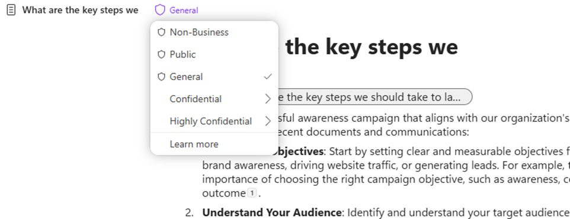
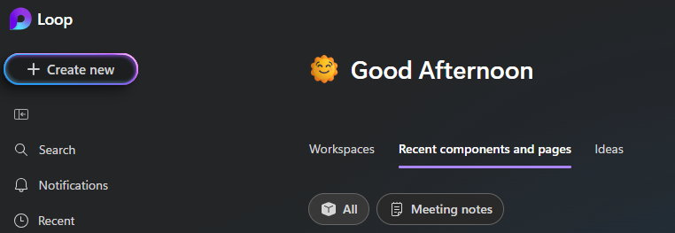

---
demo:
  title: 'العرض التوضيحي: Business Chat و Pages'
---

[العودة إلى الفهرس](https://microsoftlearning.github.io/MS-4012-Microsoft-Copilot-Web-Based-Interactive-Experience-for-Executives/)

# عرض توضيحي لـ BizChat (الأجهزة المحمولة والحاسوب الشخصي)

## خطوات العرض التوضيحي لـ BizChat Mobile

1. شغّل Copilot على جهازك المحمول.

1. تأكد من تحديد **علامة التبويب العمل**.

1. اكتب أو استخدم صوتك لإدخال المطالبة التالية:

   ```text
   can you find me any emails from earlier today from my colleague [colleagues name] and list up any action items
   ```
1. مثال آخر يمكنك استخدامه:

   ```text
   summarize the info you have on <Customer XYZ> in my calendar for this week
   ```

## خطوات العرض التوضيحي لـ BizChat في Microsoft 365

1. شغّل BizChat بالانتقال إلى [m365.cloud.microsoft/chat](https://m365.cloud.microsoft/chat).

1. مع فتح BizChat، تأكد من تحديد علامة تبويب "العمل".

    

1. اكتب المطالبة التالية:

    ```text
    What are the key steps we should take to launch a successful Giving Campaign within our company?
    ```

1. بعد ذلك، قم بتصدير الرد إلى **Pages** من خلال تحديد **تحرير في Pages**:

    

1. بعد ذلك، يمكن تعيين تسميات حساسية العرض داخل الصفحة:

    

1. الآن، يمكنك إظهار الأماكن التي يمكن الوصول إلى الصفحات فيها. يوجد خياران:

    - الوصول من تطبيق Pages نفسه (تتم مزامنته تلقائيًا):

        

    - الوصول من داخل Loop، ضمن **المكونات والأفكار الحديثة**:

        

1. انتقل مرة أخرى إلى علامة التبويب "الصفحات" المفتوحة حيث لا تزال "الصفحة" معروضة (https://m365.cloud.microsoft/pages)).

1. واصل العمل مع الصفحة عن طريق كتابة المطالبة التالية:

     ```text
     Can you elaborate more on what the guidelines are for creating a new Giving Campaing events page?
     ```

     

1. في أسفل الصفحة، اكتب رمز at (**@**). يؤدي هذا إلى فتح قائمة سياقية للبحث عن الأشخاص والملفات والاجتماعات والمزيد:

1. أضف أيًا من زملائك من قائمة الأشخاص.

1. بعد إضافة زميلك، انقر فوق اسمه لمنحه إمكانية الوصول. سيتلقون إشعارًا عبر البريد الإلكتروني يحتوي على رابط للتعاون في "الصفحة":

    

1. بمجرد حصول زميلك على حق الوصول، يكون قادرًا على مواصلة العمل على الصفحة عبر Outlook أو Pages أو Loop. 


[العودة إلى الفهرس](https://microsoftlearning.github.io/MS-4012-Microsoft-Copilot-Web-Based-Interactive-Experience-for-Executives/)
